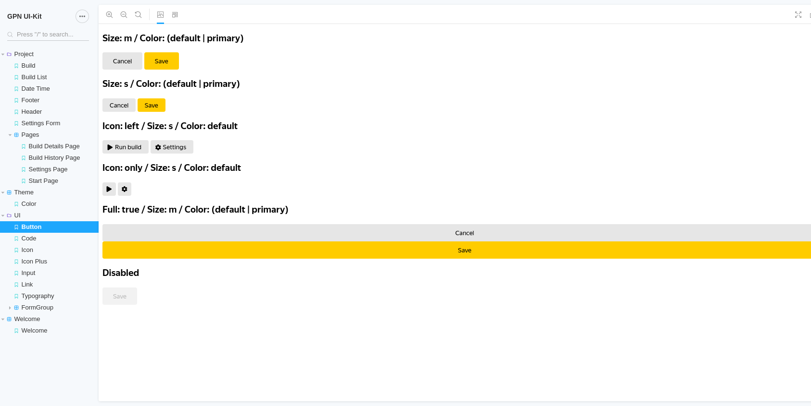
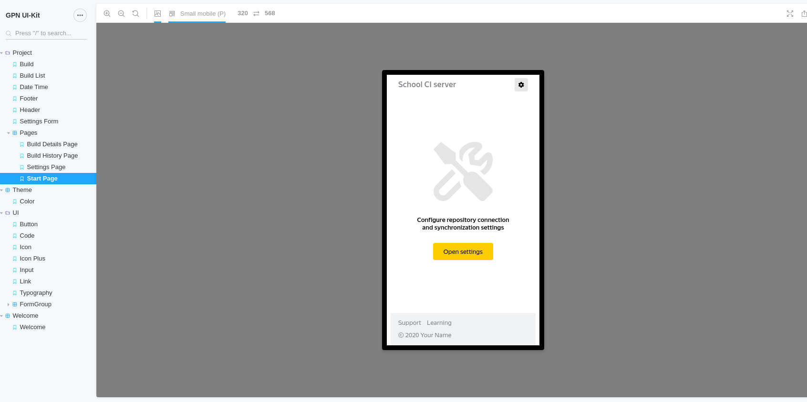

<p align="center">
  <a href="" rel="noopener">
 </a>
</p>

<h3 align="center">Yandex SHRI 2020, CI layouts</h3>

---

<p align="center"> School CI server (layouts)</p>

## 📝 Table of Contents

- [About](#about)
- [Getting Started](#getting_started)
- [Deployment](#deployment)
- [TODO](#todo)
- [Built Using](built_using)
- [Authors](#authors)

## 🧐 About <a name = "about"></a>



Для наглядности изолированности блоков я использовал storybook. Проект разбил на Theme, UI и Project. В storybook можно менять viewport и тему (пока она одна).

Тему можно настраивать по разным параметрам: цвета, шрифты, размеры шрифтов, элементы формы, отступы (см. папку Theme).

Стили каждого блока лежат отдельно в папке блока и подключаются в .storybook/preview.js

Html разметка также лежит в папках блоков.

Верстка страниц находится в src/components/Project/Pages.

Верстку делал по принципу mobile first.


## 🏁 Getting Started <a name = "getting_started"></a>

### Installing

```
git clone git@github.com:MOTORIST/shri-2020-homework-bem.git
cd shri-2020-homework-bem
yarn install
```

### Run

```
yarn storybook
```

## 🚀 Deployment <a name = "deployment"></a>

```
yarn build-storybook
```

## ✔️ TODO <a name = "todo"></a>

  - разобраться с цветами (не все цвета выделены в общие переменные)
  - сделать повторное review отступов
  - реализовать ClearButton в Input через :placeholder-shown

## ⛏️ Built Using <a name = "built_using"></a>

### storybook
- @storybook/addon-viewport
- @storybook/html
- storybook-addon-themes

### postcss
- postcss-calc
- postcss-color-function
- postcss-nested
- postcss-simple-vars

## ✍️ Authors <a name = "authors"></a>

- [@MOTORIST](https://github.com/MOTORIST)
